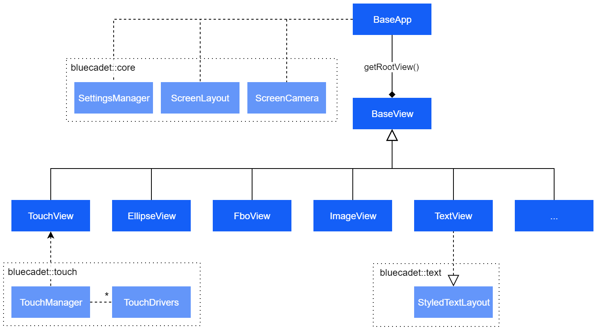
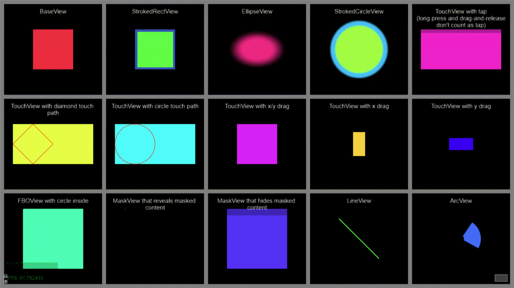

# Cinder-BluecadetViews

This block presents a set of classes to build an interactive scene graph and a set of base implementations to more easily create app UIs in Cinder.

The scene graph is composed of individual views, which can have children and each have basic animatable properties like `position`, `scale`, `rotation` and `alpha`. Children inherit their parents' transformations.

In addition to nested transformations and drawing, this block connects to the text and touch blocks to provide `TextView` and `TouchView`.

To combine all pieces conveniently, this block comes with a `BaseApp` class that provides a basic implementation with a root view, touch manager and various utilities.

Built for and tested with [Cinder v0.9.2 dev](https://github.com/cinder/Cinder/). See [notes below](#notes) for setup instructions.



## Key Features

### Scene Graph

* Add/remove children to/from `BaseView`s and all its subclasses
* Conversion from/to local/global coordinate spaces
* Simple event system to bubble messages up the graph
* Index management (e.g. move child to front/back)
* Inherited transformations, alpha and tint

### Touch Management

* Support for TUIO, native touch and mouse events
* Touch simulator for stress-testing tapping and dragging
* Multi-touch simulator for mouse input (e.g. to scale/rotate)
* Extendable plugin architecture (e.g. for TangibleEngine pucks or third-party gesture libraries like GestureWorks)
* Shape-based hit detection with ability to override on a per-class basis

### Core App Classes

* Define screen layout for multi-screen matrices
* Pan and zoom around your app using keyboard shortcuts with a minimap with touchable views
* Central, extendable settings manager to load common and custom JSON and CLI settings like FPS, V-Sync, Screen Layout, etc.

### BaseView

A basic, rectangular view with an optional size and background color that can contain children and be added as a child to other `BaseView`s.

* Animatable properties: `position`, `scale`, `rotation`, `tint`, `alpha`, `backgroundColor`
* Transform origin for rotating and scaling around a local point
* `update()` and `draw()` loops

### TouchView

* Extends `BaseView` with added touch capabilities
* Touch *began*, *updated* and *ended* events, overrideable protected methods and explicit signals 
* Distinction between dragging and tapping with distance and time thresholds

### TextView

* Multi-line text layout with basic inline styling support
* HTML tags: `<b>`, `<i>`, `<br>`, `<p>`
* Styles: `fontFamily`, `fontStyle`, `fontWeight`, `fontSize`, `leadingOffset`, `textColor`, `textAlign`, `textTransform`
* Automatic word-wrapping and other layout modes (single line, strip line-breaks, multi-line clip, multi-line auto-wrap)
* `string` and `wstring` support
* Layout-caching minimizes re-calculation of layout while maintaining ability to call methods like `getSize()` at any time
* *Windows only, requires [Cinder-BluecadetText](/bluecadet/Cinder-BluecadetText)*

### View Samples



## Getting Started

Clone the block and check the dependencies below to make sure you're all set to start your first project.

You can use the boilerplate below for your main application file:

```c++
#include "cinder/app/App.h"
#include "cinder/app/RendererGl.h"
#include "cinder/gl/gl.h"

#include "bluecadet/core/BaseApp.h"
#include "bluecadet/views/TouchView.h"

using namespace ci;
using namespace ci::app;
using namespace std;

using namespace bluecadet::core;
using namespace bluecadet::views;
using namespace bluecadet::touch;

class BaseAppSampleApp : public BaseApp {
public:
	static void prepareSettings(ci::app::App::Settings* settings);
	void setup() override;
	void update() override;
	void draw() override;
};

void BaseAppSampleApp::prepareSettings(ci::app::App::Settings* settings) {
	// Optional: Override the shared settings manager instance with your subclass
	SettingsManager::setInstance(myApp::MyAppSettingsManager::getInstance());
	
	// Initialize the settings manager with the cinder app settings and the settings json
	SettingsManager::getInstance()->setup(settings, ci::app::getAssetPath("settings.json"), [](SettingsManager * manager) {
		// Optional: Override json defaults at runtime
		manager->mFullscreen = false;
		manager->mWindowSize = ivec2(1280, 720);
	});
}

void BaseAppSampleApp::setup() {

	BaseApp::setup();
	BaseApp::addTouchSimulatorParams();

	// Optional: configure your root view
	getRootView()->setBackgroundColor(Color::gray(0.5f));

	// Sample content
	auto button = TouchViewRef(new TouchView());
	button->setPosition(vec2(400, 300));
	button->setSize(vec2(200, 100));
	button->setBackgroundColor(Color(1, 0, 0));
	button->getSignalTapped().connect([=](bluecadet::touch::TouchEvent e) { CI_LOG_I("Button tapped"); });
	getRootView()->addChild(button);
}

void BaseAppSampleApp::update() {
	// Optional override. BaseApp::update() will update all views.
	BaseApp::update();
}

void BaseAppSampleApp::draw() {
	// Optional override. BaseApp::draw() will draw all views.
	BaseApp::draw();
}

// Make sure to pass a reference to prepareSettings to configure the app correctly. MSAA and other render options are optional.
CINDER_APP(BaseAppSampleApp, RendererGl(RendererGl::Options().msaa(4)), BaseAppSampleApp::prepareSettings);

```

## Custom Subviews

Out of the box, Cinder-BluecadetViews supplies the most basic types of views needed to stub out an interactive application. Eventually, you'll want to write your own `BaseView` subclasses that override `update()` or `draw()`.

Below is a simple example:

### PathView.h

```c++
#pragma once

#include "bluecadet/views/BaseView.h"

typedef std::shared_ptr<class PathView> PathViewRef;

class PathView : public bluecadet::views::BaseView {

public:
	PathView(ci::Path2d path) : mPath(path) {}
	~PathView() {}

protected:
	void update(const double deltaTime) override;
	void draw() override;

	ci::Path2d mPath;
};
```

### PathView.cpp

```c++
#include "PathView.h"

using namespace ci;
using namespace ci::app;
using namespace std;

void PathView::update(const double deltaTime) {
	// update your view on each frame if you'd like
	// no need to call base view implementation
}
void PathView::draw() {
	// no need to call base view implementation
	// unless you want to draw a solid rect of
	// getSize() and getBackgroundColor()
	// bluecadet::views::BaseView::draw();
	
	// you could set the color to the current background color
	// but by default getTint() and getAlpha() are used
	// gl::color(getBackgroundColor());
	
	// this will draw the path using the current color, which
	// defaults to getDrawColor() (combination of tint and alpha)
	gl::draw(mPath);
}
```


## Dependencies

* Cinder-BluecadetText (https://github.com/bluecadet/Cinder-BluecadetText)
* Cinder OSC block
* Cinder TUIO block

## Notes

Version 1.5.0

Built for [Cinder v0.9.2 dev](https://github.com/cinder/Cinder/) and [Cinder v0.9.1](https://github.com/cinder/Cinder/tree/v0.9.1). Samples require VS 2015 v140 toolset, but tested with VS 2013 v120 as well.

Cinder setup instructions:

```bash
# Cinder dev
git clone --depth 1 --recursive https://github.com/cinder/Cinder.git

# Cinder 0.9.1 stable
# git clone -b v0.9.1 --depth 1 --recursive https://github.com/cinder/Cinder.git

# Bluecadet blocks + dependencies
cd Cinder/blocks
git clone git@github.com:bluecadet/Cinder-BluecadetText.git
git clone git@github.com:bluecadet/Cinder-BluecadetViews.git
```
